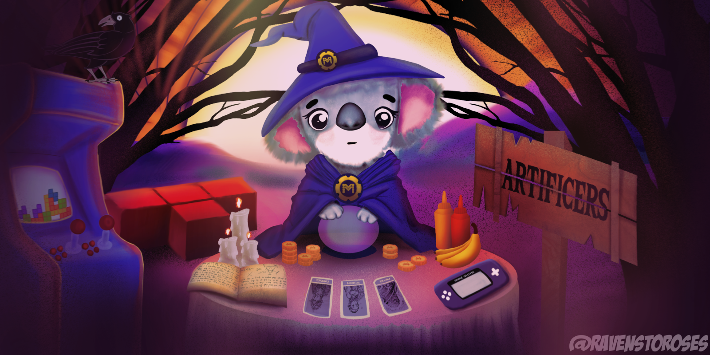
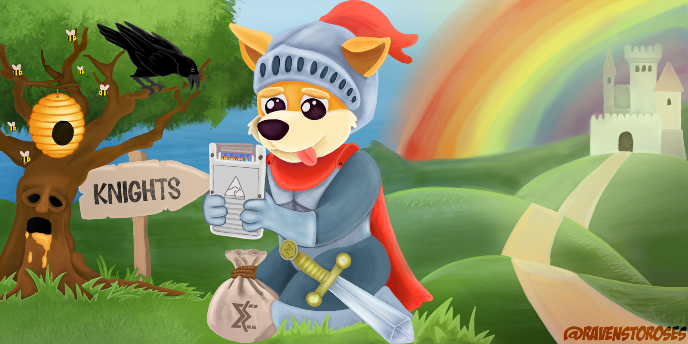
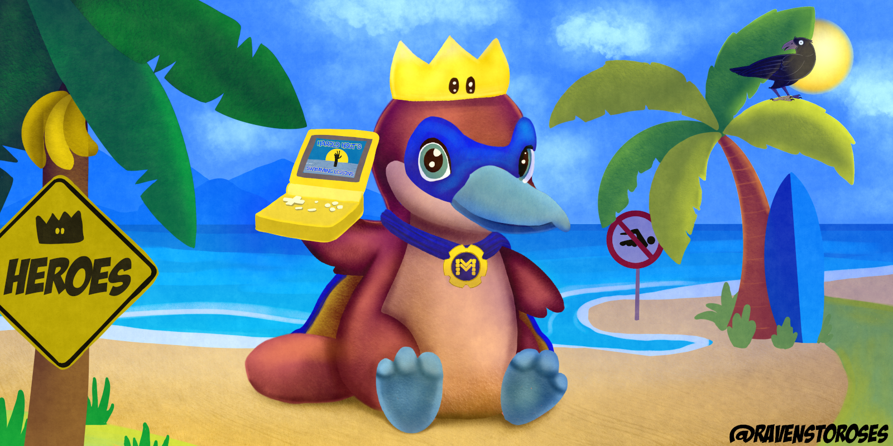

# Supporting MuOS
Thank you for your interest in potentially donating or subscribing to muOS. Everything goes towards software, hardware, and other accessories to benefit the development of muOS. If you would like to support us you can either send a single one-off donation or you can subscribe which will give you additional benefits if you are part of our Discord community.

[Support muOS through Ko-fi](https://ko-fi.com/xonglebongle/)

# Artificer

### $6 per month
Gain access to the muOS testing crew to preview new features and fixes before everybody else!
  * Weekly testing updates
  * Special Discord access

[Subscribe to the Artificer tier!](https://ko-fi.com/summary/06452d9a-0046-42c2-8b2b-78290ef6c1ce)

# Knight

### $9 per month
Gain access to the exclusive testing group and test brand new content and features before anybody else! All ideas will be highly considered and may be implemented in a future update.
  * Weekly testing updates
  * Your name on the credits screen
  * Special Discord access

[Subscribe to the Knight tier!](https://ko-fi.com/summary/1f8db546-b1c4-460a-8071-b5c51caba440)

# Hero

### $12 per month
Complete behind the scene access to all nightly development ramblings. Have your input fully considered into brand new not seen before programs. Help guide muOS in a unique way to improve it for everyone!
  * Nightly development exclusives
  * Your name on the credits screen
  * Special Discord access
  * Behind The Scenes

[Subscribe to the Hero tier!](https://ko-fi.com/summary/8d9e9924-fb00-468f-a178-18d33be9bb54)
