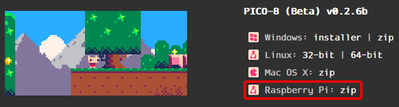

## PICO-8 Emulator Files

Starting with muOS v10. Native PICO-8 is now supported!  
The files required to run PICO-8 natively are stored on SD1 in the /MUOS/emulator/pico8 folder.  
In order to use native PICO-8 you'll need to place your own purchased binaries in there.  
You will need a copy of the following files from the **Raspberry Pi** version:  
- pico8_64
- pico8.dat

For muOS v10 you need the 32bit binary.
- pico8_dyn
- pico8.dat

## Where can I get those binaries?
You can purchase PICO-8 from lexaloffle.  
[https://www.lexaloffle.com/pico-8.php](https://www.lexaloffle.com/pico-8.php)

## Can I use Splore?
You sure can!  
You can either create a blank file named Splore.p8 [case sensitive] in your PICO-8 ROMs folder, or it will be automatically created for you when you first assign the PICO-8 (External) core.  
**Simply launch that Splore file and you're in!**
