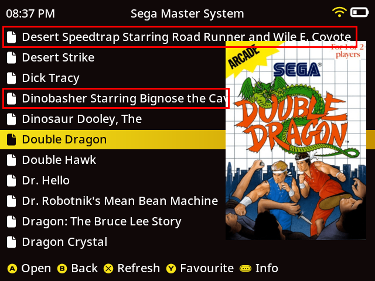
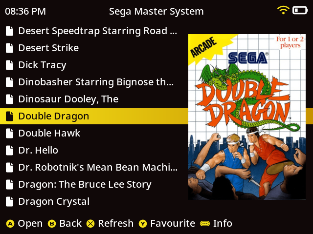

# muOS Artwork


## muOS Catalogue Structure

muOS's catalogue (which contains information on your ROMs, as well as associated images) is structured as such:

```
SD1
└─ MUOS
    └── info
        └── catalogue
            ├── <System>
            │    ├── box
            │    │   └── romname.png
            │    ├── preview
            │    │   └── romname.png
            │    ├── splash
            │    │   └── romname.png
            │    └── text
            │        └── romname.txt
            ├── Folder
            │    ├── box
            │    │   └── foldername.png
            │    ├── preview
            │    │   └── foldername.png
            │    └── text
            │        └── foldername.txt
            └── Root
                └── box
                     ├── sd1.png
                     └── sd2.png
```

These systems match the `catalogue=` entry in `MUOS/info/assign/<system>.ini`  
Folders for all available systems should be automatically created for you.  

### Example INI file

```ini
[global]
name = Atari 2600
default = Stella
catalogue = Atari 2600
cache = 0
```

Here we can see the catalogue folder for this system is `Atari 2600`.

## Matching image files to your ROMs

To have your artwork properly show up, ensure these three things:

1. Your artwork filename should match the ROM filename. For example, if you have a ROM called `Chrono Trigger (USA).zip`, the artwork filename should be `Chrono Trigger (USA).png`
2. Your artwork must be placed in the correct location: `box/` (for boxart) or `preview/` (for preview images/screenshots) inside `MUOS/info/catalogue/<SystemName>/`.
For example, we would store our chrono trigger artwork as `MUOS/info/catalogue/Nintendo SNES-SFC/box/Chrono Trigger (USA).png`. We use *Nintendo SNES-SFC* because as stated earlier, this is the defined catalogue folder name for SNES content.
3. Have the correct system assigned to your folder(s).
   - muOS attempts to assign systems to your folders automatically. But in edge cases where it doesn't, and you see no artwork being shown, simply navigate to the folder in the content explorer (for example, `Nintendo/SNES/`), press Select, and assign a core. Either choose to assign to the directory, or recursively so that all subfolders are also matched. 

Note: muOS will check for artwork independently of a system's subfolders. So, say your ROM file is located at `SD2/roms/Nintendo/SNES/JRPGs/Chrono Trigger (USA).zip`, muOS will only check in the *root* of `MUOS/info/catalogue/Nintendo SNES-SFC/box/`, and will ignore subfolders inside the boxart folder. So if you place your art in `MUOS/info/catalogue/Nintendo SNES-SFC/box/JRPGs`, it won't detect the artwork.

## Folder artwork

The folder named **Folder** can be used to apply artwork to any folder in content explorer and just needs to match the
folder name.  
(_not case sensitive_).
To have folder icons for all subdirectories listed, you would need:

```
catalogue
└── Folder
    └── box
        ├── nintendo.png
        ├── snes.png
        └── action.png
```

## Advanced Box Art Configuration

Advanced Box Art Configuration allows for overriding how box art is displayed within content explore. Up to 5 images can
be displayed. Images are loaded from separate sub folders of `/MUOS/info/catalogue/` as defined in the configuration.
See examples below.

### File Structure

Configuration files must be created in the catalogue folder to enable this feature. You can have one configuration per
catalogue folder for example `Sega Mega Drive - Genesis.ini`. If a configuration file does not exist for the
folder then `default.ini` will be used.<br><br>
**Example File Structure**

```
SD1
└─ MUOS
    └── info
        └── catalogue
            ├── default.ini
            ├── Folder.ini
            └── Sega Mega Drive - Genesis.ini
```

### Configuration File Breakdown

### Section [viewport]

The viewport section configures the canvas that all images will be drawn on. Alignment of the view port is controlled
by `Configuration -> General Settings -> Interface Options -> Content Box Art Alignment`

| Setting                 | Description                                                                                                            |
|-------------------------|------------------------------------------------------------------------------------------------------------------------|
| WIDTH=354               | Width in pixels of the canvase.  Setting of 0 will size to content.                                                    |
| HEIGHT=0                | Height in pixels of the canvase.  Setting of 0 will size to content.                                                   |
| COLUMN_MODE=1           | With Column Mode enabled all images are stacked vertically. Image padding can be used to control space between images. |
| COLUMN_MODE_ALIGNMENT=2 | When COLUMN_MODE controls the horizontal alignment of all images. <br>0=Left<br>1=Right<br>2=Center                    |

### Section [image#]

A maximum of 5 image locations can be defined starting with section [image1] to section [image5].

| Setting      | Description                                                                                                                                                                                                                        |
|--------------|------------------------------------------------------------------------------------------------------------------------------------------------------------------------------------------------------------------------------------|
| FOLDER=box   | Name of the folder in `/MUOS/info/catalogue/` where the image is located                                                                                                                                                           |
| ALIGN=2      | When COLUMN_MODE=0 this controls the alignment of the image within the viewport <br>1=Top Left<br>2=Top Center<br>3=Top Right<br>4=Bottom Left<br>5=Bottom Center<br>6=Bottom Right<br>7=Center Left<br>8=Center Right<br>9=Center |
| MAX_WIDTH=0  | Used to resize the image. Maximum Image Width.                                                                                                                                                                                     |
| MAX_HEIGHT=0 | Used to resize the image. Maximum Image Height.                                                                                                                                                                                    |
| PAD_LEFT=0   | Used to adjust position of the image in pixels.                                                                                                                                                                                    |
| PAD_RIGHT=0  | Used to adjust position of the image in pixels.                                                                                                                                                                                    |
| PAD_TOP=0    | Used to adjust position of the image in pixels.                                                                                                                                                                                    |
| PAD_BOTTOM=0 | Used to adjust position of the image in pixels.                                                                                                                                                                                    |

**Note:** Resizing images using MAX_WIDTH and MAX_HEIGHT settings cause graphical issues like screen tearing while fast
scrolling. It is recommended to leave these settings at 0 and instead resize your images to the appropriate size.

### Example ini configuration for Column Mode

```ini
[viewport]
WIDTH=354
HEIGHT=0
COLUMN_MODE=1
COLUMN_MODE_ALIGNMENT=2

[image1]
FOLDER=box324x300

[image2]
FOLDER=preview324x300
PAD_TOP=15
```

### Example ini configuration for Standard Mode

```ini
[viewport]
WIDTH=354
HEIGHT=480
COLUMN_MODE=0
COLUMN_MODE_ALIGNMENT=0

[image1]
FOLDER=box324
ALIGN=8
MAX_WIDTH=0
MAX_HEIGHT=0
PAD_LEFT=0
PAD_RIGHT=15
PAD_TOP=0
PAD_BOTTOM=0
```

### Example file tree for Column Mode example

```
└─ MUOS
    └── info
        └── catalogue
            └── <System>
                ├── box
                │   └── romname.png
                ├── preview
                │   └── romname.png
                ├── text
                │   └── romname.txt
                ├── box324x300
                │   └── romname.png
                └── preview324x300
                     └── romname.png
``` 

## Theme overrides for Artwork

The max width for the text of an item in content explorer is controlled by the theme. This can result in scenarios where
the item text is partially covered by the boxart. <br>

 <br>
You can override this behaviour so regardless of what theme you have installed the text will stop at a defined length.
In `/theme/override` you will find 3 files `muxfavourite.txt`, `muxhistory.txt`, and `muxplore.txt`.<br>

If you want to adjust just where the text auto ellipses you can set a value for FONT_LIST_PAD_RIGHT. Example:

```ini
[font]
FONT_LIST_PAD_RIGHT=280

[misc]
CONTENT_WIDTH=-1
```

<br>
If you also want the background bar of the item to resize you would instead adjust CONTENT_WIDTH. Example:

```ini
[font]
FONT_LIST_PAD_RIGHT=10

[misc]
CONTENT_WIDTH=360
```

<br>

## Special Folders

There are three special folders within the catalogue: `Application`, `Archive`, and `Task`.

```
└─ MUOS
    └── info
        └── catalogue
            └── <special_folder_name>
                ├── box
                │   └── name_of_file.png
                └── wall
                    └── 640x480
                    │   └── name_of_file.png
                    └── 720x720
                        └── name_of_file.png
```

* Within these folders are the names of the Application, Archive, or Task Toolkit
* These will take precedence over the active theme

{: .highlight }
> If you are distributing an application, archive, or task you could bundle these up too!

## antiKk's muOS Artwork

Skraper mixes, and Artwork for the Tiny Best Set are available here:  
[https://github.com/antiKk/muOS-Artwork](https://github.com/antiKk/muOS-Artwork)
