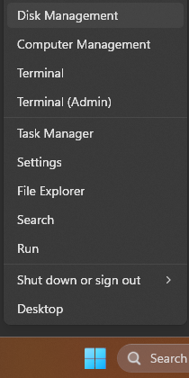

## Help! Windows can't see my muOS SD2 card
So you've flashed muOS to an SD Card and run through the first boot and now you want to copy stuff over, but Windows can't even see the SD Card?!? What gives?

This is almost certainly the result of Windows simply not assigning a drive letter.

## How do I fix this?
With your SD Card inserted into your computer, **right-click** on your Start Menu and click on **Disk Management**.  

Once you're in **Disk Management** simply locate your SD Card.
It should show up as **Removable** and have quite a lot of partitions.  

Once you've found it, **right-click** on the far right partition (**ROMS**) and choose **Change Drive Letter and Paths...**  

Assign and **Drive Letter** and you should be able to see it in Windows now!
