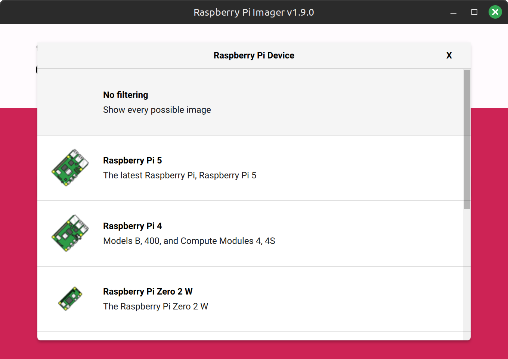
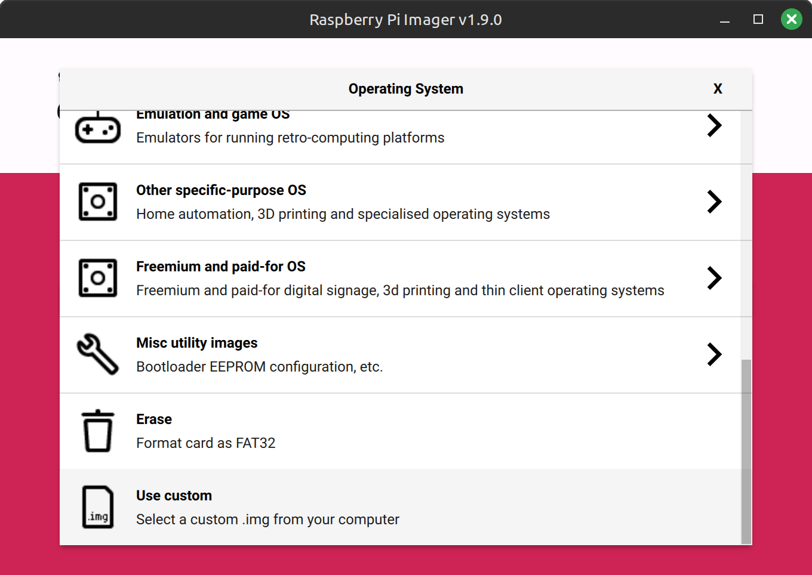
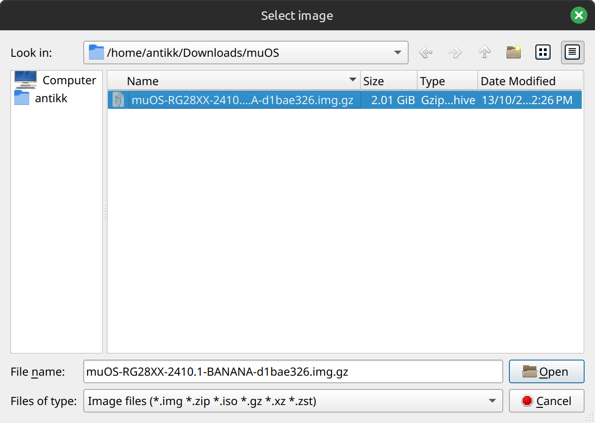

# Download
Download the latest image from one of the following channels.
{: .fs-6 .fw-300 }

[Download here](https://dl.muos.dev){: .btn .btn-primary .fs-5 .mb-4 .mb-md-0 .mr-2 }

# Extracting
muOS images are distributed as ``.img.gz`` files and most imaging software shouldn't require them to be extracted.


# SD Card Quality
Please make sure that you flash any CFW on a **quality SD card**.
This will ensure your data stays safe and doesn't fail on you in the middle of catching that rare Pokémon!
**Samsung and Sandisk cards are recommended.**

# Flashing
There are several recommended programs you can use to flash your SD card
*   Raspberry Pi Imager - [https://github.com/raspberrypi/rpi-imager/releases](https://github.com/raspberrypi/rpi-imager/releases)
*   Alex's USB Image Tool - [https://www.alexpage.de/usb-image-tool/](https://www.alexpage.de/usb-image-tool/)
*   Rufus - [https://rufus.ie/en/](https://rufus.ie/en/)
*   Win32 Disk Imager - [https://sourceforge.net/projects/win32diskimager/](https://sourceforge.net/projects/win32diskimager/)
*   USBImager - [https://gitlab.com/bztsrc/usbimager](https://gitlab.com/bztsrc/usbimager)

## Raspberry Pi Imager
After countless flashes we have determined that the most user friendly tool with the highest chance of success is Raspberry Pi Imager so we'll focus on that for now.

| :-----------------------------: | :-----------------------------: |
| Choose Device                   | No Filtering                    |
|   |   |
| Choose Use Custom OS            | Select the muOS .img.gz         |
|   |   |

# Advanced Flashing
If you're not afraid of using command line tools you can use dd to get the job done.
You will need to find out what device path your SD card is located.
Make sure to replace `sd_device` with your SD card device location and `muos_image` with the image name.

``sudo dd if=muos_image of=sd_device bs=4M status=progress && sync``

For MacOS users (determine your SD card label with diskutil GUI or `diskutil list` command and replace `X`):
```bash
# To get rid of "dd: /dev/rdiskX: Resource busy"
sudo diskutil unmountDisk force /dev/diskX

# For best performance use the "RAW" device:
sudo dd if=/path/to/muos_image_file.img of=/dev/rdiskX bs=4M status=progress && sync
```

# Finishing Up
Once flashing to an SD card is successful you can put it in your device and switch it on
It will run through a few menus to help get setup first and it will then do the rest of the setup for you. 
This will create all the needed files and folders for you to put your favourite content on.

{: .important-title }
> Be Patient
>
>If you find that your device is stuck during "Factory Reset" please give it at least 5-10 minutes before hitting the reset button. This should not happen, but if it does please make a post in the Discord issues channel.

# Updating An Existing Install
Currently, muOS only supports updating versions by re-flashing the SD card, which can erase important data
if you're not careful!

A second SD can be used to preserve ROM files, but keep in mind that save data and configuration are still on SD1.
To preserve this data, use the backup feature built into muOS. On 2405.1 and above, this is under the Task Toolkit menu.

1. Create a backup .zip file from the muOS menu and store it on an external device.
2. If using a single SD card, back up all ROM files.
3. When you are CERTAIN that your data is safe, proceed with the flashing and installation method above.
4. Unzip the backup in the root of SD1 ROMS/ partition, so that the folders merge with one another.
5. If using a single SD card, copy ROM files back onto the SD Card.

<div itemscope itemtype="https://schema.org/WebSite">
  <meta itemprop="url" content="https://muos.dev"/>
  <meta itemprop="name" content="muOS - Custom Firmware"/>
</div>
