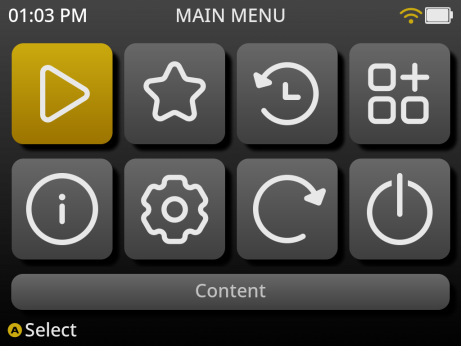

# **Welcome to MustardOS**

MustardOS (muOS) is a Custom Firmware (CFW) primarily for handheld devices. Configurable, themeable, friendly,
easy-to-use.
{: .fs-6 .fw-300 }

Designed to give your device a fresh, modern feel, MustardOS puts control and personalisation in your hands. With an
emphasis on flexibility, it lets you shape the look, style, and behaviour of your handheld so it feels truly your own.
From everyday play to inquisitive tinkering, MustardOS is built to adapt to you.

***

# Download

[Latest](release/current/golden){: .btn .btn-primary .fs-5 .mb-4 .mb-md-0 .mr-2 .text-grey-dk-300 }

{: .note }
> Always ensure you download from our official download page or supported mirrors!

***

# Socials

[Instagram](https://instagram.com/muos.dev){: .btn .btn-primary .fs-5 .mb-4 .mb-md-0 .mr-2 .text-grey-dk-300 }
[Twitter/X](https://x.com/@_mustardOS){: .btn .fs-5 .mb-4 .mb-md-0 }

***

# Community

[Discord](https://discord.gg/muos){: .btn .btn-primary .fs-5 .mb-4 .mb-md-0 .mr-2 .text-grey-dk-300 }
[Forum](https://community.muos.dev/){: .btn .fs-5 .mb-4 .mb-md-0 }
[IRC](https://web.libera.chat/#MustardOS){: .btn .fs-5 .mb-4 .mb-md-0 }
[Merch](https://shop.muos.dev/){: .btn .fs-5 .mb-4 .mb-md-0 }

***

## About

What began as a small personal hobby project has since grown into something far greater than I could have ever
imagined. Over time, it has developed into a thriving community of passionate people who share the same love for games,
tinkering, and discovery. I am deeply grateful for the support, feedback, and enthusiasm that has helped shape this
project into what it is today.

MustardOS is built around a simple philosophy: keep things easy, intuitive, and enjoyable. At its core, it exists to let
you jump straight into playing your favourite games with minimal setup, removing the complexity so you can focus on what
matters most—having fun.

Our hope is that this custom firmware not only enhances your handheld experience, but also brings you as much joy as
we've had creating and refining it.

***

## Features

One of the defining qualities of MustardOS is just how effortless it is to get started. Installation is straightforward
and familiar: just like with other custom firmwares, you use your preferred image flashing tool to write MustardOS onto
an SD Card.

From there, the process is seamless. Insert the SD Card into your handheld, power it on, and the system takes care of
the rest. No complicated setup. No confusing steps. Just a smooth and ready-to-play experience right from the first
boot.

Whether you're new to handhelds or a seasoned enthusiast, MustardOS is designed to get you playing quickly while still
offering plenty of depth and customisation for those who enjoy exploring further.

***

## Handy Hotkeys

| Type                    | Control (_Before Goose_) | Control (_After Goose_) |
|:------------------------|:----------------------------|:---------------------------|
| Brightness (Anbernic)   | MENU + VOLUME UP/DOWN       | MENU + VOLUME UP/DOWN      |
| Brightness (TrimUI)     | N/A                         | SWITCH + VOLUME UP/DOWN    |
| Screenshot              | MENU + POWER                | L2 + R2 + X                |
| Sleep Suspend / Wake    | Hold POWER for 2 seconds    | Press POWER once           |
| Charging Wake / Boot    | Use the POWER button        | Use the START button       |
| Kiosk Mode Settings     | N/A                         | L1 + R2 + Y on config      |
| Safe Restart            | L2 + R2 + START             | L2 + R2 + START            |
| Safe Shutdown           | L2 + R2 + SELECT            | L2 + R2 + SELECT           |
| Modify Core / Governor  | Press SELECT on content     | Press SELECT on content    |
| Content Root            | Press START on content      | Press START on content     |
| Shuffle Content         | Press R2 on content         | Press R2 on content        |
| RetroArch Menu          | MENU + X                    | MENU + X                   |
| RetroArch Close Content | MENU + START                | MENU + START               |
| Fast Forward Toggle     | MENU + R1                   | MENU + R1                  |
| Load State              | MENU + L2                   | MENU + L2                  |
| Save State              | MENU + R2                   | MENU + R2                  |
| Save State Decrement    | Menu + DPAD LEFT            | MENU + DPAD LEFT           |
| Save State Increment    | Menu + DPAD RIGHT           | MENU + DPAD RIGHT          |
| Slow Motion             | MENU + L1                   | MENU + L1                  |
| Show FPS Toggle         | MENU + Y                    | MENU + Y                   |
| Swap Dpad <> Analogue   | Short Press POWER           | L2 + R2 + A                |

{: .note }
> Swap Dpad <> Analogue is only for devices without analogue sticks.

### LED Hotkeys

| Type                | Control                  |
|:--------------------|:-------------------------|
| Change Mode         | MENU + R3                |
| Increase Brightness | MENU + Right Stick Up    |
| Decrease Brightness | MENU + Right Stick Down  |
| Previous Colour     | MENU + Right Stick Left  |
| Next Colour         | MENU + Right Stick Right |

{: .note }
> * Exchange right stick for left stick on the RG40XX-V device.
> * These do **NOT** work on the TrimUI devices.
> * The Smart Pro has **NO** analogue stick click, no L3, no R3.
> * The Brick has **NO** analogue sticks for adjustments.

## Devices

| Supported            |
|:---------------------|
| Anbernic RG28XX      |
| Anbernic RG34XX      |
| Anbernic RG34XX SP   |
| Anbernic RG35XX 2024 |
| Anbernic RG35XX PLUS |
| Anbernic RG35XX PRO  |
| Anbernic RG35XX H    |
| Anbernic RG35XX SP   |
| Anbernic RG40XX H    |
| Anbernic RG40XX V    |
| Anbernic RGCUBEXX    |
| Trimui Brick         |
| Trimui Smart Pro     |

| In Development |
|:---------------|
| Magic Zero28   |
| H36S           |
| R36S           |

| Planned           |
|:------------------|
| Anbernic ARC-D    |
| Game Kiddy Bubble |
| MagicX XU Mini28  |

| Removed            |
|:-------------------|
| Anbernic RG35XX OG |

  <meta itemprop="url" content="https://muos.dev"/>
  <meta itemprop="name" content="MustardOS - Custom Firmware"/>

