# Download

[Latest](/release/current){: .btn .btn-primary .fs-5 .mb-4 .mb-md-0 .mr-2 .text-grey-dk-300 }

{: .note }
> Always ensure you download from our official download page or supported mirrors!

# Extracting

MustardOS images are distributed as `.img.gz` files and most imaging software shouldn't require them to be extracted.

# SD Card Quality

Please make sure that you flash any CFW on a **quality SD card of 16GB or larger**.
This will ensure your data stays safe and doesn't fail on you in the middle of catching that rare Pokémon!
**Samsung and Sandisk cards are recommended.**

# Flashing

There are several recommended programs you can use to flash your SD card

* Raspberry Pi Imager - [https://github.com/raspberrypi/rpi-imager/releases](https://github.com/raspberrypi/rpi-imager/releases)
* Alex's USB Image Tool - [https://www.alexpage.de/usb-image-tool/](https://www.alexpage.de/usb-image-tool/)
* Rufus - [https://rufus.ie/en/](https://rufus.ie/en/)
* Win32 Disk Imager - [https://sourceforge.net/projects/win32diskimager/](https://sourceforge.net/projects/win32diskimager/)
* USBImager - [https://gitlab.com/bztsrc/usbimager](https://gitlab.com/bztsrc/usbimager)

{: .warning}
>
> Balena Etcher is **NOT** recommended due to repeated issues with bad flashes.

## Raspberry Pi Imager

After countless flashes we have determined that the most user friendly tool with the highest chance of success is
Raspberry Pi Imager so we'll focus on that for now.

| 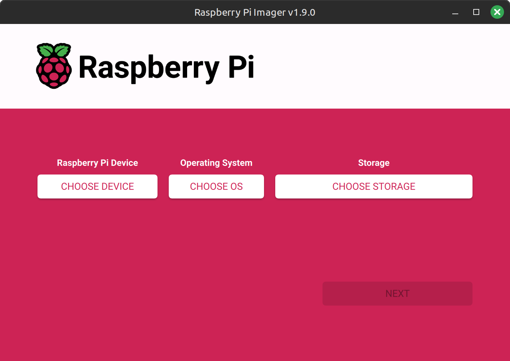 | 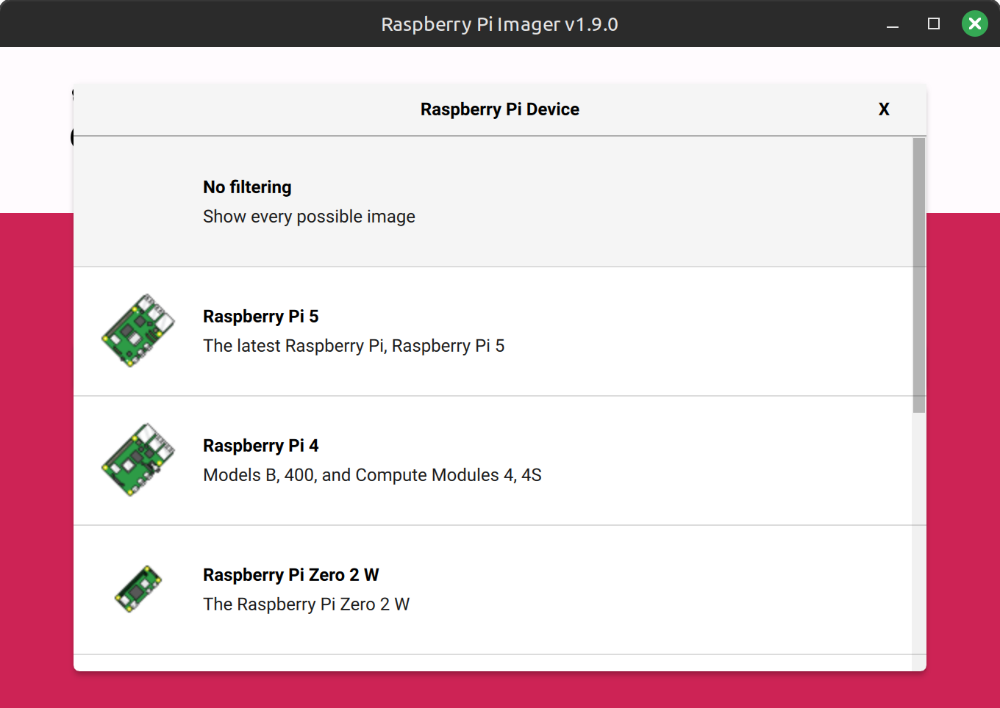 |
|:------------------------------:|:------------------------------:|
|         Choose Device          |          No Filtering          |
| 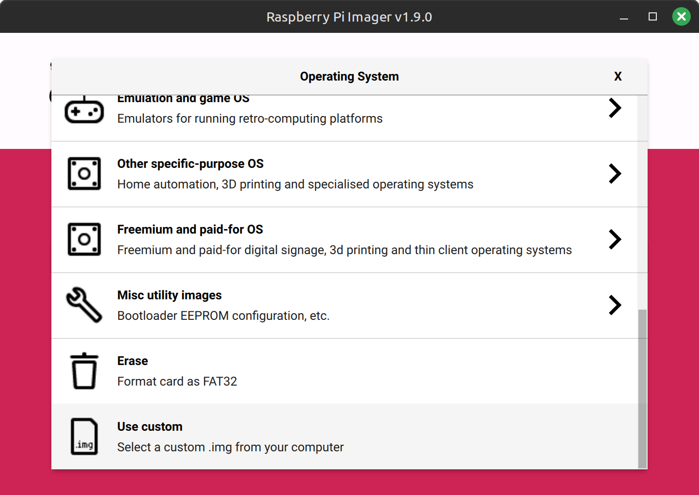 | 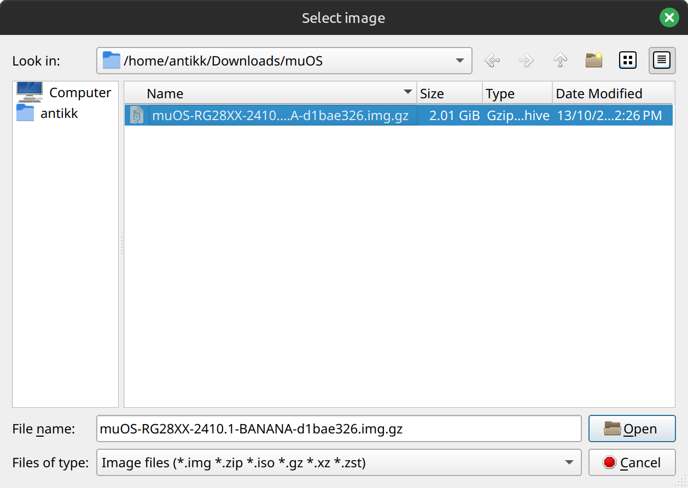 |
|      Choose Use Custom OS      |  Select the MustardOS .img.gz  |
| 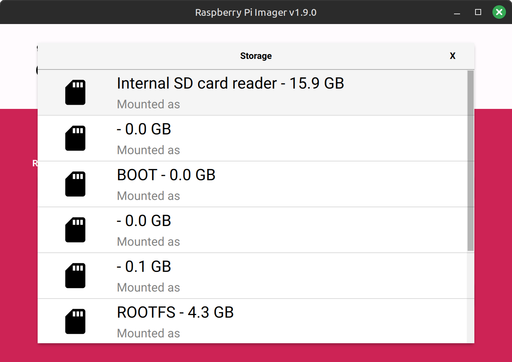 | 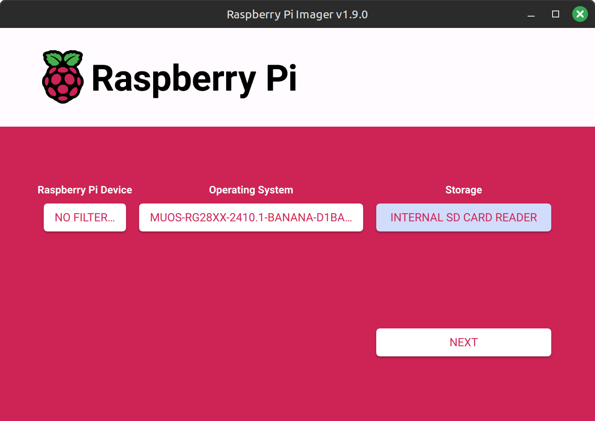 |
|     Choose SD Card Reader      |           Click Next           |
| 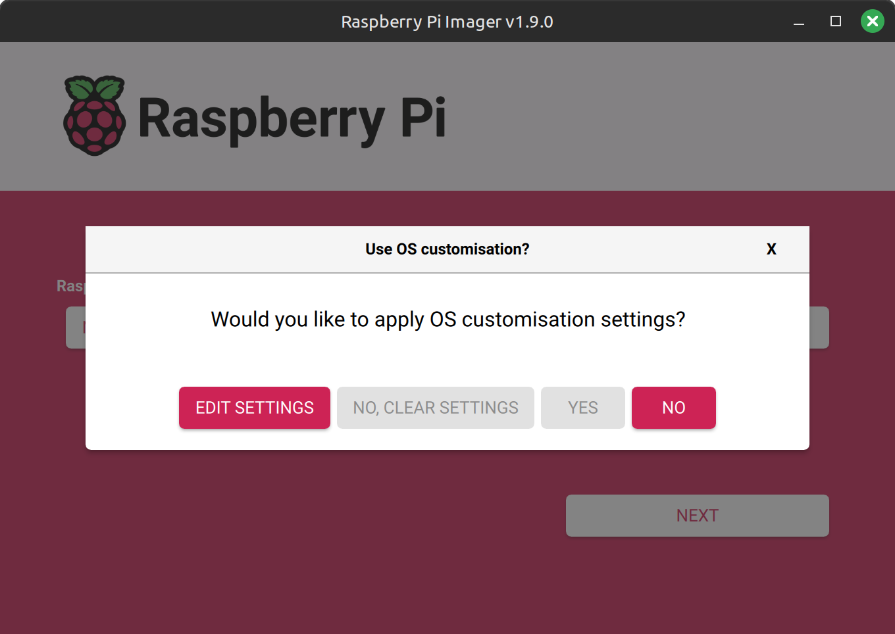 | 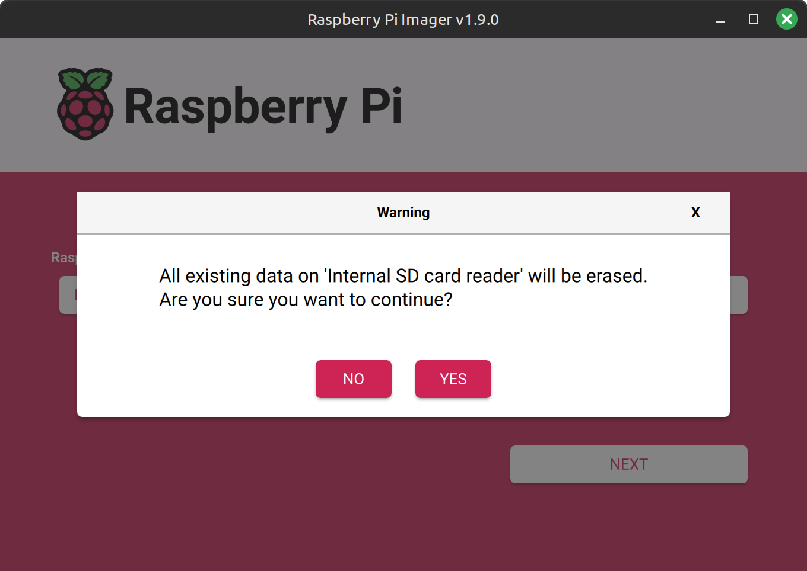 |
|      No OS Customisation       |       Yes Erase SD Card        |
| 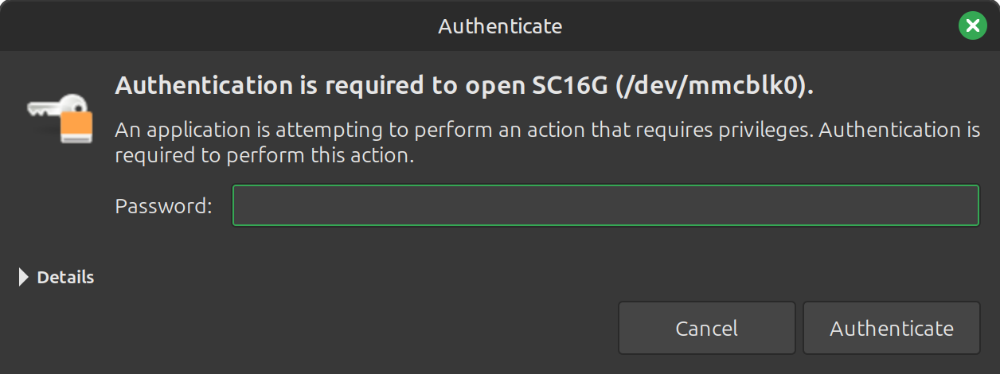 | 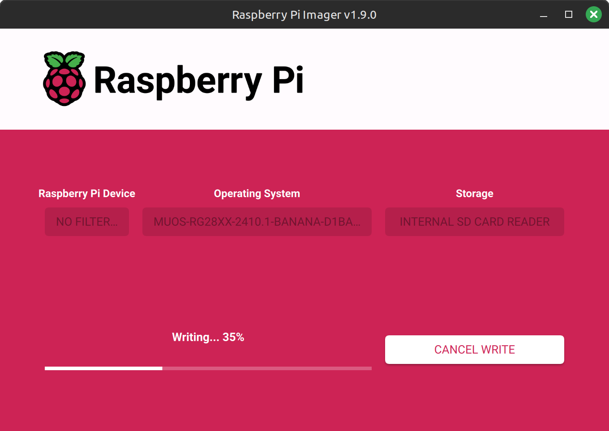 |
|       Approve Elevation        |      Card begins Writing       |
| 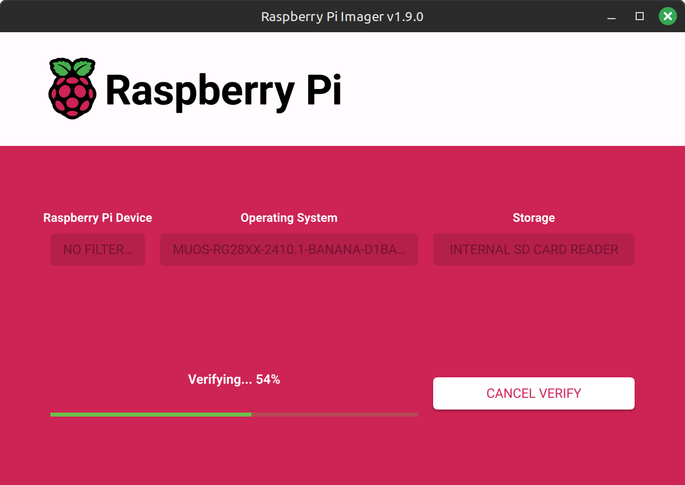 | 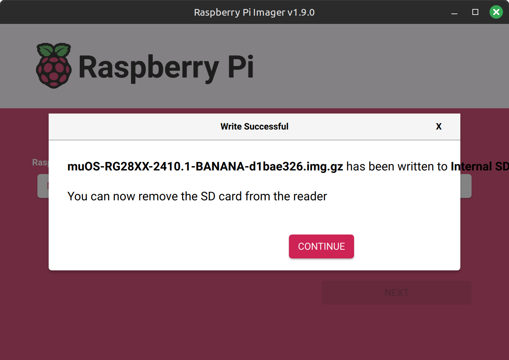 |
|         Verify Begins          | Eject and insert into console  |

# Advanced Flashing

If you're not afraid of using command line tools you can use dd to get the job done.
You will need to find out what device path your SD card is located.
Make sure to replace `sd_device` with your SD card device location and `muos_image` with the image name.

``gunzip -c < "image_name_here.img.gz" | sudo dd of=/dev/sdxyz bs=4M conv=fsync status=progress``

For MacOS users (determine your SD card label with `diskutil list` command and replace the `X` in `/dev/diskX`):

```bash
# To get rid of "dd: /dev/rdiskX: Resource busy"
sudo diskutil unmountDisk force /dev/diskX

# For best performance use the "RAW" device:
sudo dd if=/path/to/image_name_here.img of=/dev/rdiskX bs=4M status=progress && sync
```

# Finishing Up

Once flashing to an SD card is successful you can put it in your device and switch it on
It will run through a few menus to help get setup first and it will then do the rest of the setup for you.
This will create all the needed files and folders for you to put your favourite content on.

{: .important-title }
> **Be Patient**
>
>If you find that your device is stuck during "Factory Reset" please give it at least 5-10 minutes before hitting the
> reset button. This should not happen, but if it does please make a post in the Community Forum issues channel.

# Updating An Existing Install

When updating to a new version of MustardOS we always recommend that you backup your data and flash a fresh image.   
If you have used our Storage options to keep saves, config etc... on SD2 this method is quick and painless.

We do often offer a smaller update Archive which can be used to update between versions, but you may miss important
features when updating this way.

<div itemscope itemtype="https://schema.org/WebSite">
  <meta itemprop="url" content="https://muos.dev"/>
  <meta itemprop="name" content="MustardOS - Custom Firmware"/>
</div>
