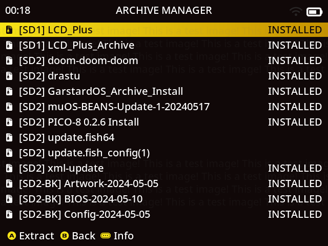

# Archive Manager

NOTE: Only install archives that you trust!
{: .label .label-yellow }

**We accept no responsibility for either the content of your archives or any loss of data or functionality as a result
of using this feature.**

The Archive Manager is located at `Applications > Archive Manager`


## How does it work?

If it doesn't exist, you can create a folder named `ARCHIVE` in the root of `SD1, SD2, USB`   
Here you can place specially created archive manager `.mux*` files (see [Pixie Archive Formats](#pixie-archive-formats).  
The archive manager will extract the contents of **any** `.mux*` file, so it's important that they are created correctly.

### Example

```
SD2
└── Archive
    ├── BIOS Files.muxzip
    ├── Retroarch Overrides.muxzip
    ├── Save Games.muxzip
    └── WiFi Config.muxzip
USB
└── Archive
    └── Box Art.muxzip
```

## Pixie Archive Formats

With the release of MuOS Pixie, 6 new archive formats were introduced. Each of these file types can be created by making a zip file with the appropriate internal structure, then renaming to the desired extension. All formats will be detailed below, but know that *most* archives will use `.muxupd` or `.muxzip`. When in doubt, go with `.muxzip`.

#### `.muxapp`

This format will extract its contents to `MUOS/application`.

#### `.muxcat`

This format will be moved to the appropriate place at `MUOS/package/catalogue`.

#### `.muxcfg`

This format will be moved to the appropriate place at `MUOS/package/catalogue`.

#### `.muxzip`
This is an ordinary archive package (See [How should I structure the Archive .muxzip files?](##how-should-i-structure-the-archive-muxzip-files) section below).
#### `.muxupd`
Similar to `.muxzip`, but with the additional step of running a shell script upon install (See [How do I make use of Archive .muxupd files?](##how-do-i-make-use-of-archive-muxupd-files) section below).


## How should I structure the Archive .muxzip files?

Each archive file extracts to / so this means you need to ensure that the archive contains the **Full Path** you wish to
extract to.

### Example

To create an archive of your muOS saves the zip should contain the complete file path.

```
mnt
└─ mmc
   └── MUOS
       └── save
           ├── file
           │   └── <core>
           │       └── <save files>
           └── state
               └── <core>
                   └── <save files>
```

SD1 root is `/mnt/mmc`   
SD2 root is `/mnt/sdcard`   
USB root is `/mnt/usb`

## How do I make use of Archive .muxupd files?

Archive files in the `.muxupd` format work very similar to `.muxzip` files, extracting the contents to / and requiring the internal structure of the Archive match the **Full Path** you wish to extract to. The key difference is that `.muxupd` files must also include a file named `update.sh` in the `/opt` directory. This update script is automatically run upon installation.

### Example
To package an application install/update should contain the complete file path

```
├── mnt
│   └── mmc
│       └── MUOS
│           └── application
│               └── <application folder>
└── opt
    ├── muos
    │   └── default
    │       └── MUOS
    │           └── theme
    │               └── active
    │                   └── glyph
    │                       └── muxapp
    │                           └── <app icon>.png
    └── update.sh
```

SD1 root is `/mnt/mmc`   
SD2 root is `/mnt/sdcard`   
USB root is `/mnt/usb`

## What can I restore with this Archive Manager?

It's very flexible and can be used for pretty much anything.  
Simply create a `.muxzip` file with the correct path.

### Example

Want to backup and restore your favourite games? Go for it!

```
mnt/mmc/roms/Game Boy Color/Opossum Country.zip
```

Want to share your latest Pokemon save with a friend? No problem!

```
run/muos/global/save/file/gpSP/Pokemon Emerald.srm
```
