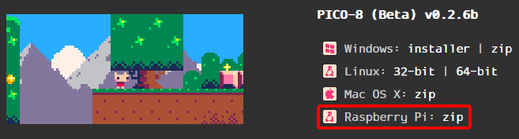

# Available Emulators

| Name                                                        | Type             | Version           |
|:------------------------------------------------------------|:-----------------|:------------------|
| [PICO-8](https://www.lexaloffle.com/pico-8.php)             | Standalone       |                   |
| [fake-08](https://github.com/jtothebell/fake-08)            | Libretro Core    | 0.0.2.19          |
| [Retro8](https://github.com/Jakz/retro8)                    | Libretro Core    |                   |

## Default Emulator

By default muOS uses the fake-08 libretro core.  
This is only the default because it doesn't require you to purchase the native PICO-8 application.  
We strongly suggest you purchase the native application to support this wonderful system!

## PICO-8 Emulator Files

Native PICO-8 is now supported!  
Starting with muOS Banana, the pico8 files can go in your `MUOS/bios/pico8` on either SD1 or SD2 depending on where you've chosen to put those.  
Older version of muOS require the files here: `/MUOS/emulator/pico8`
The files required to run PICO-8 natively are stored on SD1 in the /MUOS/emulator/pico8 folder.  
In order to use native PICO-8 you'll need to place your own purchased binaries in there.  
You will need a copy of the following files from the **Raspberry Pi** version:  
- pico8_64
- pico8.dat

Starting with muOS Pixie you can now drop your official pico-8 zip into `/ARCHIVE` on either SD Card and install using muOS Archive Manager.  
The file is named `pico-8_0.2.6b_raspi.zip` as of the writing of this page.

Once you add your purchased files from Lexaloffle you'll need to set muOS to use the PICO-8 External emulator.
- Browse to where your PICO-8 games are in muOS content explorer.
- Press select on any of the items and change core.
- Select ``PICO-8 (External)`` and press ``X`` to set this core for the whole directory! 

## PICO-8 Standalone Keys

| Button         | Action             |
|:---------------|:-------------------|
| DPAD           | Move               |
| A / R1         | Button X           |
| B / L1         | Button O           |
| Start          | Pause              |
| Select         | Cancel             |
| L2             | Toggle Mouse Mode  |
| Left Stick     | Mouse              |
| A (Mouse Mode) | Left Mouse         |
| B (Mouse Mode) | Right Mouse        |
| Start + Select | Quit               |

{: .new}
> Mouse Mode coming soon!

**Legacy Instructions**
For muOS v10 you need the 32bit binary.
- pico8_dyn
- pico8.dat

## Where can I get those binaries?
You can purchase PICO-8 from lexaloffle.  
[https://www.lexaloffle.com/pico-8.php](https://www.lexaloffle.com/pico-8.php)

## Can I use Splore?
You sure can!  
You will need to create a blank file named `Splore.p8` [case sensitive] in your PICO-8 ROMs folder.  
You can also download a suitable file   
**Simply launch that Splore file from muOS and you're in!**
