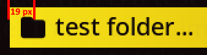

# Scheme File Introduction
Scheme files will determine what to do with your files within `./images/` and alter the aesthetic and operations of your theme.
You'll be able to change variables per program here such as;
- The alignment of the navigation buttons in the footer.
- Colour and transparency of all text + backgrounds.
- Positioning of text.

***Hex codes*** are 6 digit sequences that determine the colours of different elements.

***Alphas range*** from 0-255, with 0 being invisible and 255 being opaque.

Below you will find all the available attributes you can change in a scheme file, and explanations for every line.

> *Tip: Refer to the Theme Structure page to find the muxprogram list. Each individual page
> can have unique properties by creating another* `.txt` *file within the* `./scheme/` *folder with matching names to that program.*

# Scheme File Line-By-Line

This is an example of a random `./scheme/default.txt` file from the theme library.

### Section [background]

| Setting          | Description                                       |
|------------------|---------------------------------------------------|
| BACKGROUND=000000              |  Background colour. Most used in [list] gradients.|
| BACKGROUND_ALPHA=0             |  Background colour transparency.|

### Section [font]

| Setting          | Description                                       |
|------------------|---------------------------------------------------|
| FONT_HEADER_PAD_TOP=0              |  Number of pixels from top of header area to header text.|
| FONT_HEADER_PAD_BOTTOM=0           |  Number of pixels from bottom of header area to header text.|
| FONT_HEADER_ICON_PAD_TOP=0         |  Number of pixels from top of header area to header icons.|
| FONT_HEADER_ICON_PAD_BOTTOM=0      |  Number of pixels from bottom of header area to header icons.|
| FONT_FOOTER_PAD_TOP=0              |  Number of pixels from top of footer area to footer text.|
| FONT_FOOTER_PAD_BOTTOM=0           |  Number of pixels from bottom of footer area to footer text.|
| FONT_FOOTER_ICON_PAD_TOP=0         |  Number of pixels from top of footer area to footer icons.|
| FONT_FOOTER_ICON_PAD_BOTTOM=0      |  Number of pixels from bottom of footer area to footer icons.|
| FONT_MESSAGE_PAD_TOP=0             |  Number of pixels from top of message area to message text.|
| FONT_MESSAGE_PAD_BOTTOM=0          |  Number of pixels from bottom of message area to message text.|
| FONT_MESSAGE_ICON_PAD_TOP=0        |  Number of pixels from top of message area to message icons.|
| FONT_MESSAGE_ICON_PAD_BOTTOM=0     |  Number of pixels from bottom of message area to message icons.|
| FONT_LIST_PAD_TOP=0                |  Number of pixels from top of a list item area to a list item text.|
| FONT_LIST_PAD_BOTTOM=0             |  Number of pixels from bottom of an item area to a list item text.|
| FONT_LIST_PAD_LEFT=0               |  Number of pixels from left of a list item area to a list item text.|
| FONT_LIST_PAD_RIGHT=0              |  Number of pixels from right of an item area to a list item text.|
| FONT_LIST_ICON_PAD_TOP=0           |  Number of pixels from top of a list item area to a list item glyph.|
| FONT_LIST_ICON_PAD_BOTTOM=0        |  Number of pixels from bottom of an item area to a list item glyph.|

**Note:** By default text and glyphs in the header, footer, and list items will be centered vertically.  It is recommended to start with a value of 0.  Depending on the font used you may need to adjust the FONT_LIST_PAD_TOP or FONT_LIST_PAD_BOTTOM settings. FONT_LIST_PAD_TOP to move the text down and FONT_LIST_PAD_BOTTOM to move the text up.  Do not use both settings at the same time.

### Section [status]

| Setting          | Description                                       |
|------------------|---------------------------------------------------|
| PADDING_RIGHT=47             |  Number of pixels from the right side of the screen to the battery icon.|

### Section [battery]

| Setting          | Description                                       |
|------------------|---------------------------------------------------|
| BATTERY_NORMAL=000000             |  Battery icon standard recolour .|
| BATTERY_ACTIVE=207d0e             |  On-charge battery icon recolour . |
| BATTERY_LOW=7d0e0e                |  Low battery icon recolour .|
| BATTERY_NORMAL_ALPHA=255          |  Battery icon standard recolour transparency. |
| BATTERY_ACTIVE_ALPHA=255          |  On-charge battery icon recolour transparency.|
| BATTERY_LOW_ALPHA=255             |  Low battery icon recolour transparency.|

### Section [network]

| Setting          | Description                                       |
|------------------|---------------------------------------------------|
| NETWORK_NORMAL=53422e           |  Disconnected network icon recolour .|
| NETWORK_ACTIVE=000000           |  Connected network icon recolour .|
| NETWORK_NORMAL_ALPHA=255        |  Disconnected network icon recolour transparency.|
| NETWORK_ACTIVE_ALPHA=255        |  Connected network icon recolour transparency.|

### Section [bluetooth]

| Setting          | Description                                       |
|------------------|---------------------------------------------------|
| BLUETOOTH_NORMAL=53422e           |  Disconnected bluetooth icon colour. Yet to be implemented.|
| BLUETOOTH_ACTIVE=000000           |  Connected bluetooth icon colour. Yet to be implemented.|
| BLUETOOTH_NORMAL_ALPHA=255        |  Disconnected bluetooth icon transparency. Yet to be implemented.|
| BLUETOOTH_ACTIVE_ALPHA=255        |  Connected bluetooth icon transparency. Yet to be implemented.|

### Section [date]

| Setting          | Description                                       |
|------------------|---------------------------------------------------|
| DATETIME_TEXT=000000        |  Time text colour.|
| DATETIME_ALPHA=255          |  Time text transparency.|
| PADDING_LEFT=49             |  Number of pixels from the left side of the screen to the time text.|

### Section [footer]

| Setting          | Description                                       |
|------------------|---------------------------------------------------|
| FOOTER_HEIGHT=42                |  Adjust the height of the footer by pixels.|
| FOOTER_BACKGROUND=000000        |  Footer area/background colour.|
| FOOTER_BACKGROUND_ALPHA=0       |  Footer area/background transparency.|
| FOOTER_TEXT=000000              |  Footer text colour, not including any navigation buttons.|
| FOOTER_TEXT_ALPHA=255           |  Footer text transparency, not including any navigation buttons.|

### Section [header]

| Setting          | Description                                       |
|------------------|---------------------------------------------------|
| HEADER_HEIGHT=42                |  Adjust the height of the header by pixels.|
| HEADER_BACKGROUND=000000        |  Header area/background colour.|
| HEADER_BACKGROUND_ALPHA=0       |  Header area/background transparency.|
| HEADER_TEXT=000000              |  Header text colour, not including time text.|
| HEADER_TEXT_ALPHA=255           |  Header text transparency, not including time text.|

### Section [help]

| Setting          | Description                                       |
|------------------|---------------------------------------------------|
| HELP_BACKGROUND=5d0014            |  Help/info background window colour.|
| HELP_BACKGROUND_ALPHA=255         |  Help/info background window transparency.|
| HELP_BORDER=ffe5b9                |  Help/info window border colour.|
| HELP_BORDER_ALPHA=255             |  Help/info window border transparency.|
| HELP_CONTENT=ffe5b9               |  Help/info window standard text colour.|
| HELP_TITLE=ffe5b9                 |  Help/info window title text colour.|
| HELP_RADIUS=10                    |  Border roundness. 0 is a right angle. 10+ is very round.|

### Section [navigation]

| Setting          | Description                                       |
|------------------|---------------------------------------------------|
| ALIGNMENT=1                    |  Regarding all navigation buttons in the footer. 0 = aligned to the left, 1 = central aligned, 2 = aligned to the right. Anything above is a secret.|
| NAV_A_GLYPH=000000             |  The device's "A" button - icon recolour . |
| NAV_A_GLYPH_ALPHA=255          |  The device's "A" button - icon transparency.|
| NAV_A_GLYPH_RECOLOUR_ALPHA=255 |  The device's "A" button - icon recolour transparency.|
| NAV_A_TEXT=000000              |  Text describing the function of the "A" button - recolour .|
| NAV_A_TEXT_ALPHA=255           |  Text describing the function of the "A" button - transparency.|
| NAV_B_GLYPH=000000             |  The device's "B" button - icon colour.|
| NAV_B_GLYPH_ALPHA=255          |  The device's "B" button - icon transparency.|
| NAV_B_GLYPH_RECOLOUR_ALPHA=255 |  The device's "B" button - icon recolour transparency.|
| NAV_B_TEXT=000000              |  Text describing the function of the "B" button - recolour .|
| NAV_B_TEXT_ALPHA=255           |  Text describing the function of the "B" button - transparency.|
| NAV_C_GLYPH=000000             |  The device's "C" button - icon colour.|
| NAV_C_GLYPH_ALPHA=255          |  The device's "C" button - icon transparency.|
| NAV_C_GLYPH_RECOLOUR_ALPHA=255 |  The device's "C" button - icon recolour transparency.|
| NAV_C_TEXT=000000              |  Text describing the function of the "C" button - recolour .|
| NAV_C_TEXT_ALPHA=255           |  Text describing the function of the "C" button - transparency.|
| NAV_X_GLYPH=000000             |  The device's "X" button - icon colour.|
| NAV_X_GLYPH_ALPHA=255          |  The device's "X" button - icon transparency.|
| NAV_X_GLYPH_RECOLOUR_ALPHA=255 |  The device's "X" button - icon recolour transparency.|
| NAV_X_TEXT=000000              |  Text describing the function of the "X" button - recolour .|
| NAV_X_TEXT_ALPHA=255           |  Text describing the function of the "X" button - transparency.|
| NAV_Y_GLYPH=000000             |  The device's "Y" button - icon colour.|
| NAV_Y_GLYPH_ALPHA=255          |  The device's "Y" button - icon transparency.|
| NAV_Y_GLYPH_RECOLOUR_ALPHA=255 |  The device's "Y" button - icon recolour transparency.|
| NAV_Y_TEXT=000000              |  Text describing the function of the "Y" button - recolour .|
| NAV_Y_TEXT_ALPHA=255           |  Text describing the function of the "Y" button - transparency.|
| NAV_Z_GLYPH=000000             |  The device's "Z" button - icon colour.|
| NAV_Z_GLYPH_ALPHA=255          |  The device's "Z" button - icon transparency.|
| NAV_Z_GLYPH_RECOLOUR_ALPHA=255 |  The device's "Z" button - icon recolour transparency.|
| NAV_Z_TEXT=000000              |  Text describing the function of the "Z" button - recolour .|
| NAV_Z_TEXT_ALPHA=255           |  Text describing the function of the "Z" button - transparency.|
| NAV_MENU_GLYPH=000000          |  The device's "M/MENU" button - icon colour.|
| NAV_MENU_GLYPH_ALPHA=255       |  The device's "M/MENU" button - icon transparency.|
| NAV_MENU_GLYPH_RECOLOUR_ALPHA=255 |  The device's "M/MENU" button - icon recolour transparency.|
| NAV_MENU_TEXT=000000           |  Text describing the function of the "M" button - recolour .|
| NAV_MENU_TEXT_ALPHA=255        |  Text describing the function of the "M" button - transparency.|

### Section [list]
For all list item backgrounds, gradients can be applied. L-R = 0-255.

| Setting          | Description                                       |
|------------------|---------------------------------------------------|
| LIST_DEFAULT_RADIUS=0                 |  Background window border radius. 0 = square, 5+ = round. This applies setting applies to LIST_DEFAULT_BACKGROUND & LIST_FOCUS_BACKGROUND |
| LIST_DEFAULT_BACKGROUND=ececec        |  Unselected list item main background colour.|
| LIST_DEFAULT_BACKGROUND_ALPHA=0       |  Unselected list item main background transparency.|
| LIST_DEFAULT_GRADIENT_START=0         |  Start point of gradient change. [background] changes 2nd colour.|
| LIST_DEFAULT_GRADIENT_STOP=0          |  End point of gradient change.|
| LIST_DEFAULT_INDICATOR=ececec         |  Unselected list item " | " indicator colour.|
| LIST_DEFAULT_INDICATOR_ALPHA=0        |  Unselected list item " | " indicator transparency.|
| LIST_DEFAULT_TEXT=53422e              |  Unselected list item text colour.|
| LIST_DEFAULT_TEXT_ALPHA=255           |  Unselected list item text transparency.|
| LIST_DEFAULT_GLYPH_PAD_LEFT=19        |  Adjusts the padding in pixels from the left side of the list item to the center of the glyph.  |
| LIST_DEFAULT_GLYPH_ALPHA=255          |  List item glyph transparency|
| LIST_DEFAULT_GLYPH_RECOLOUR=53422e    |  Unselected list item glyph recolour.|
| LIST_DEFAULT_GLYPH_RECOLOUR_ALPHA=255 |  Transparency of this colour.|
| LIST_DISABLED_TEXT=a78b65             |  Unavailable list item text colour.|
| LIST_DISABLED_TEXT_ALPHA=255          |  Unavailable list item text transparency.|
| LIST_FOCUS_BACKGROUND=000000          |  Selected list item main background colour.|
| LIST_FOCUS_BACKGROUND_ALPHA=0         |  Selected list item main background transparency.|
| LIST_FOCUS_GRADIENT_START=0           |  Start point of gradient change. [background] changes 2nd colour.|
| LIST_FOCUS_GRADIENT_STOP=0            |  End point of gradient change.|
| LIST_FOCUS_INDICATOR=5d0014           |  Selected list item " | " indicator colour.|
| LIST_FOCUS_INDICATOR_ALPHA=255        |  Selected list item " | " indicator transparency.|
| LIST_FOCUS_TEXT=5d0014                |  Selected list item text colour.|
| LIST_FOCUS_TEXT_ALPHA=255             |  Selected list item text transparency.|
| LIST_FOCUS_GLYPH_ALPHA=255            |  Selected List item glyph transparency.|
| LIST_FOCUS_GLYPH_RECOLOUR=5d0014      |  Selected list item glyph recolour.|
| LIST_FOCUS_GLYPH_RECOLOUR_ALPHA=255   |  Transparency of this colour.|

### Section [image_list]
Alters properties of list images. Unconfirmed if this has an effect.

| Setting          | Description                                       |
|------------------|---------------------------------------------------|
| IMAGE_LIST_ALPHA=255               |  Image transparency|
| IMAGE_LIST_RADIUS=3                |  Image window radius. 0 = no change. 10+ = heavily rounded window.|
| IMAGE_LIST_RECOLOUR=ad0000         |  Image recolour.|
| IMAGE_LIST_RECOLOUR_ALPHA=0        |  Transparency of this colour.|
| IMAGE_PREVIEW_ALPHA=255            |  Preview image transparency|
| IMAGE_PREVIEW_RADIUS=3             |  Image window radius. 0 = no change. 10+ = heavily rounded window.|
| IMAGE_PREVIEW_RECOLOUR=ad0000      |  Image recolour.|
| IMAGE_PREVIEW_RECOLOUR_ALPHA=0     |  Transparency of this colour.|

### Section [charging]
When placed on charge without booting, the charging screen will appear.

| Setting          | Description                                       |
|------------------|---------------------------------------------------|
| CHARGER_BACKGROUND=100808       |  Charging banner background colour. |
| CHARGER_BACKGROUND_ALPHA=0      |  Charging banner background transparency.|
| CHARGER_TEXT=000000             |  Charging banner text colour.|
| CHARGER_TEXT_ALPHA=255          |  Charging banner text transparency.|
| CHARGER_Y_POS=100               |  Position of the banner from the centre. -100 is up, 100 is down.|

### Section [keyboard]

| Setting          | Description                                       |
|------------------|---------------------------------------------------|
| OSK_BACKGROUND=5d0014                      |  On-screen keyboard background window colour.|
| OSK_BACKGROUND_ALPHA=255                   |  On-screen keyboard background window transparency.|
| OSK_BORDER=ffe5b9                          |  On-screen keyboard background window border colour.|
| OSK_BORDER_ALPHA=255                       |  On-screen keyboard background window border transparency.|
| OSK_RADIUS=10                              |  Background window border radius. 0 = square, 5+ = round. |
| OSK_TEXT=ffe5b9                            |  Unselected and inputted text colour.|
| OSK_TEXT_ALPHA=255                         |  Unselected and inputted text transparency.|
| OSK_TEXT_FOCUS=ffe5b9                      |  Selected text colour.|
| OSK_TEXT_FOCUS_ALPHA=255                   |  Selected text transparency.|
| OSK_ITEM_BACKGROUND=000000                 |  Unselected text background / button colour.|
| OSK_ITEM_BACKGROUND_ALPHA=50               |  Unselected text background / button transparency.|
| OSK_ITEM_BACKGROUND_FOCUS=000000           |  Selected text background / button colour.|
| OSK_ITEM_BACKGROUND_FOCUS_ALPHA=150        |  Selected text background / button transparency.|
| OSK_ITEM_BORDER=c0c0c0                     |  Unselected text button border colour.|
| OSK_ITEM_BORDER_ALPHA=0                    |  Unselected text button border transparency.|
| OSK_ITEM_BORDER_FOCUS=ffe5b9               |  Selected text button border colour.|
| OSK_ITEM_BORDER_FOCUS_ALPHA=255            |  Selected text button border transparency.|
| OSK_ITEM_RADIUS=5                          |  All button border radius. 0 = square, 5+ = round.|

### Section [notification]

| Setting          | Description                                       |
|------------------|---------------------------------------------------|
| MSG_BACKGROUND=5d0014           |  Pop-up message background colour.|
| MSG_BACKGROUND_ALPHA=255        |  Pop-up message background transparency.|
| MSG_BORDER=ffe5b9               |  Pop-up message window border colour.|
| MSG_BORDER_ALPHA=255            |  Pop-up message window border transparency.|
| MSG_RADIUS=10                   |  Pop-up message window border roundness. 0 = square, 5+ = round.|
| MSG_TEXT=ffe5b9                 |  Pop-up message text colour.|
| MSG_TEXT_ALPHA=255              |  Pop-up message text transparency.|

### Section [bar]
This is the horizontal bar showing volume/brightness.

| Setting          | Description                                       |
|------------------|---------------------------------------------------|
| BAR_BACKGROUND=5d0014                            |  Background of the bar window - colour.|
| BAR_BACKGROUND_ALPHA=255                         |  Background of the bar window - transparency.|
| BAR_BORDER=ffe5b9                                |  Bar window border colour.|
| BAR_BORDER_ALPHA=255                             |  Bar window border transparency.|
| BAR_RADIUS=10                                    |  Bar window border roundness. 0 = square, 5+ = round.|
| BAR_PROGRESS_BACKGROUND=000000                   |  Inactive section of the progress bar - colour. |
| BAR_PROGRESS_BACKGROUND_ALPHA=255                |  Inactive section of the progress bar - transparency.|
| BAR_PROGRESS_ACTIVE_BACKGROUND=ffe5b9            |  Active section of the progress bar - colour.|
| BAR_PROGRESS_ACTIVE_BACKGROUND_ALPHA=255         |  Active section of the progress bar - transparency.|
| BAR_PROGRESS_RADIUS=3                            |  Progress bar roundness. 0 = square, 5+ = round.|
| BAR_ICON=ffe5b9                                  |  Bar icon/glyph colour. Volume/brightness symbol.|
| BAR_ICON_ALPHA=255                               |  Bar icon transparency. Volume/brightness symbol.|

### Section [roll]
This relates to the passcode/lock screen when enabled in settings.

| Setting          | Description                                       |
|------------------|---------------------------------------------------|
| ROLL_TEXT=53422e                       |  Unselected passcode text colour.|
| ROLL_TEXT_ALPHA=255                    |  Unselected passcode text transparency.|
| ROLL_BACKGROUND=fbfbfb                 |  Unselected passcode background / button colour.|
| ROLL_BACKGROUND_ALPHA=255              |  Unselected passcode background / button transparency.|
| ROLL_RADIUS=10                         |  Unselected passcode button border radius.|
| ROLL_SELECT_TEXT=000000                |  Selected passcode text colour.|
| ROLL_SELECT_TEXT_ALPHA=255             |  Selected passcode text transparency.|
| ROLL_SELECT_BACKGROUND=000000          |  Selected passcode background / button colour.|
| ROLL_SELECT_BACKGROUND_ALPHA=50        |  Selected passcode background / button transparency.|
| ROLL_SELECT_RADIUS=10                  |  Selected passcode button border radius.|
| ROLL_BORDER_COLOUR=53422e              |  Window border colour.|
| ROLL_BORDER_ALPHA=255                  |  Window border transparency.|
| ROLL_BORDER_RADIUS=10                  |  Window border roundness. 0 = square, 5+ = round.|

### Section [counter]

| Setting          | Description                                       |
|------------------|---------------------------------------------------|
| COUNTER_ALIGNMENT=2            | 0 = aligned to the left, 1 = central aligned, 2 = aligned to the right.  |
| COUNTER_PADDING_AROUND=10      | Number of pixels around the text of the counter.   |
| COUNTER_PADDING_SIDE=5         | Number of pixels to move the counter from the side of the screen.  Only used with left and right alignments  |
| COUNTER_PADDING_TOP=50         | Number of pixels from screen top to place the counter.  |
| COUNTER_BORDER_COLOUR=c69200   | Border colour.   |
| COUNTER_BORDER_ALPHA=255       | Border transparency.  |
| COUNTER_BORDER_WIDTH=2         | Border width in pixels.  |
| COUNTER_RADIUS=3               | Border roundness. 0 is a right angle. 10+ is very round.  |
| COUNTER_BACKGROUND=100808      | Counter area/background colour.    |
| COUNTER_BACKGROUND_ALPHA=255   | Counter area/background transparency.   |
| COUNTER_TEXT=ffffff            | Counter text colour.  |
| COUNTER_TEXT_ALPHA=255         | Counter text transparency.  |
| COUNTER_TEXT_FADE_TIME=50      | Used to gradually fade out the counter when screen activity is idle.  A value of 0 will disable the setting.   |
| COUNTER_TEXT_SEPARATOR= of     | Separator in between the current item index and the number of items in the list.  Default value " of " which would display as "1 of 50". |

### Section [meta]

| Setting          | Description                                       |
|------------------|---------------------------------------------------|
| META_CUT=40                     |  Number of characters on each line in help/info windows before making a new one.|

### Section [misc]

| Setting          | Description                                       |
|------------------|---------------------------------------------------|
| ANIMATED_BACKGROUND=0         |  Do you want to use a .gif file in /wall? 0 is no. 1 is yes.|
| CONTENT_SIZE_TO_CONTENT=0     | Resizes list items to fit text of item. If enabled CONTENT_WIDTH will be used as a max width.|
| CONTENT_ALIGNMENT=0           | Alignment of list item. 0=Left, 1=Center, 2=Right. CONTENT_PADDING_LEFT can be used to adjust postion.  Negative value to shift items left, positive value to shift items right.  |
| CONTENT_ITEM_COUNT=13         | Number of list items displayed in content panel. This setting along with CONTENT_HEIGHT to determine the height of each item. For example if CONTENT_HEIGHT = 300 and CONTENT_ITEM_COUNT = 10 then each item will be 30px tall. The first 28px will be used to display the item followed by a 2px gap.   **Note:** This field has a minimum value of 5 and a maximum value of 13. The value set here also controls paging up and down in the list.|
| CONTENT_PADDING_LEFT=0        |  Number of pixels from screen left to list items. Commonly on 0.|
| CONTENT_PADDING_TOP=0         |  Number of pixels from screen top to list items.    **Note:** By default the list is positioned based on header height + 2px. With a default header height of 42px the list will start 44px from the top in order for it to be past the header.  If you want the content list to take up the full screen you can use a value of -44 here.  If your header height is larger you would need to adjust accordingly.|
| CONTENT_HEIGHT=392            |  Adjust the height of the content panel by pixels.  (Minimum value = 100 Maximum value = Device Screen Height) |
| CONTENT_WIDTH=640             |  Adjust the width of list item content by horizontal pixels.|
| NAVIGATION_TYPE=0             |  0: For vertical (up/down) navigation.  1: For horizontal (left/right).  2: For launch menu with two rows of 4 icons. (left/right/up/down) 3: For launch menu with two rows of icons. Top row has 3 icons and bottom row has 5 icons. (left/right/up/down)  4: Same as 2 except that left/right wraps around on the active row.  5: Same as 3 except that left/right wraps around on the active row.  |
| STATIC_ALIGNMENT=0            |  Custom images that can outside of wallpapers. See below for details.|
| OVERLAY_IMAGE=0               |  Do you want to use an overlay .png image? 0 is no. 1 is yes.|

Static Alignment Values 
* Describes the layering and position of static images with other elements.
* Place static images in ./images/static/ named similarly to wall images.
* You cannot use a default.png as a static image.
* You can use static images for individual list items and programs.

| Value | Description                          |
|-------|--------------------------------------|
| 0     | Bottom Right (Just above the footer)|
| 1     | Middle Right|
| 2     | Top Right (Just below the header)|
| 3     | Fullscreen - behind header and footer|
| 4     | Fullscreen - above header and footer|
