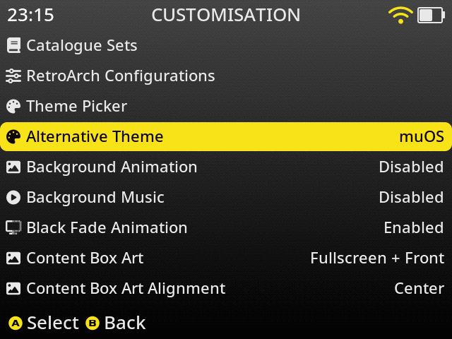
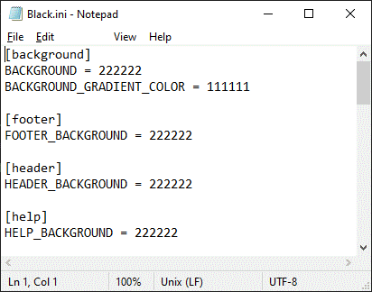
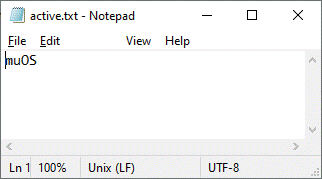

# Theme Alternatives Introduction

Theme Alternatives allows you to include multiple version of your theme in one theme file. After installing your theme
the user will be able to navigate to the  `Congiguration -> Customisation` menu and set which `Alternative Theme` to
use. The user would then press `A` to activate or press `B` to activate and exit the `Customisation` menu.



> *Examples of using Theme Alternatives can be found on the [theme](https://theme.muos.dev/) website.<br>
`MustardOS - Pixie - Grid` By: Bitter Bizarro<br>
`Aurora` By: Rosabel*

# Alternative Scheme .ini

The first way of creating a `Alternative Theme` options is by creating scheme files that adjust the styling of the
theme. The files should be located in `alternate` folder at root level of your theme archive. The name used for
each `.ini` is the name that will display in the `Congiguration -> Customisation` menu under the `Alternative Theme`
setting. The `MustardOS - Pixie - Grid` theme for example has a structure like this:

```
.
├── active.txt
├── alternate
│   └── Black.ini
│   └── Blue.ini
│   └── Green.ini
│   └── muOS.ini
│   └── Orange.ini
│   └── Purple.ini
│   └── Red.ini
│   ├── rgb
│   │   ├── Black
|   |   │   └── rgbconf.sh
│   │   ├── Blue
|   |   │   └── rgbconf.sh
│   │   ├── Green
|   |   │   └── rgbconf.sh
│   │   ├── muOS
|   |   │   └── rgbconf.sh
│   │   ├── Orange
|   |   │   └── rgbconf.sh
│   │   ├── Purple
|   |   │   └── rgbconf.sh
│   │   ├── Red
|   |   │   └── rgbconf.sh
```

Each `Alternative Theme` scheme file can include any setting but keep in mind these settings will apply to all MustardOS
screens and resolutions. Typically you would use the files to change various colour parameters.

<br>
*Example scheme file*

# RGB

You can set different RGB settings for each `Alternative Theme` defined. To do this you would need to create
a `rgbconf.sh` file with the settings you want to apply and place it into `/alternate/rgb/{name}/rgbconf.sh`. See file
structure above.

# Active text

The `active.txt` in the root of your theme is used to set the default `Alternative Theme` when the theme is first
installed.

<br>
*Example `active.txt` file*

# Alternative Scheme .muxzip

The second way of creating a `Alternative Theme` options is by creating `.muxzip` archive files that are extracted when
the options is selected. The files should be located in `alternate` folder at root level of your theme archive. The name
used for each `.muxzip` is the name that will display in the `Congiguration -> Customisation` menu under
the `Alternative Theme` setting. The `Aurora` theme for example has a structure like this:

```
.
├── active.txt
├── alternate
│   └── Cloud.muxzip
│   └── Midnight.muxzip
│   └── Moon.muxzip
│   └── Retro.muxzip
│   └── Twilight.muxzip
```

Each `Alternative Theme` `.muxzip` file will be extracted when a user selects it under `Congiguration -> Customisation`.
The file needs to be structured in a certain way in order for the files to be extracted to the active theme folder.
Below is an example of how `Cloud.muxzip` from the `Aurora` theme is structured.

```
.
├── theme
│   ├── active
│   │   ├── 640x480
│   │   │   ├── image
│   │   │   |   ├── bootlogo.bmp
│   │   │   |   ├── overlay.png
│   │   │   |   ├── reboot.png
│   │   │   |   ├── shutdown.png
│   │   │   |   ├── wall
│   │   │   |   |   ├── muxlaunch
│   │   │   |   |   |   ├── explore.png
│   │   │   |   |   |   ├── collection.png
│   │   │   |   |   |   ├── history.png
│   │   │   |   |   |   ├── apps.png
│   │   │   |   |   |   ├── info.png
│   │   │   |   |   |   ├── config.png
│   │   │   |   |   |   ├── reboot.png
│   │   │   |   |   |   └── shutdown.png
│   │   |   |   |   ├── default.png
│   │   |   |   |   ├── muxcharge.png
│   │   |   |   |   ├── muxstart.png
│   │   │   |   |   └── muxsysinfo.png
│   │   |   └── preview.png
│   │   ├── font
│   │   |   └── default.bin
│   │   ├── scheme
|   |   |   ├── global.ini
|   |   |   ├── muxlaunch.ini
│   │   |   └── muxplore.ini
```
