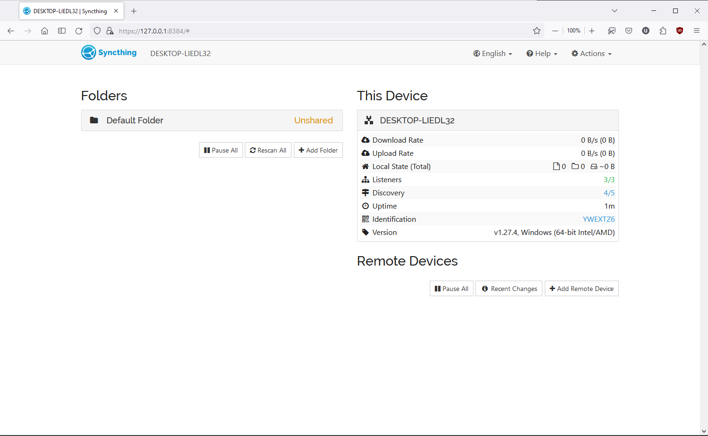
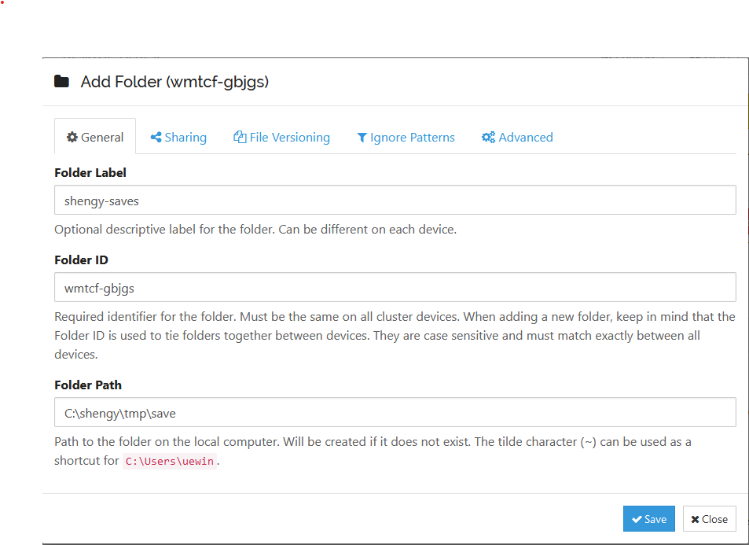
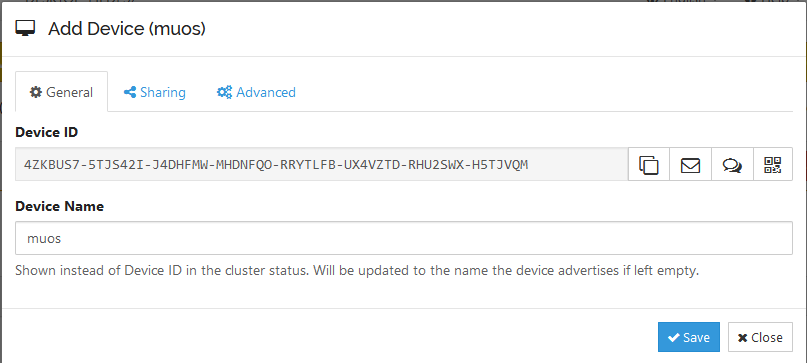
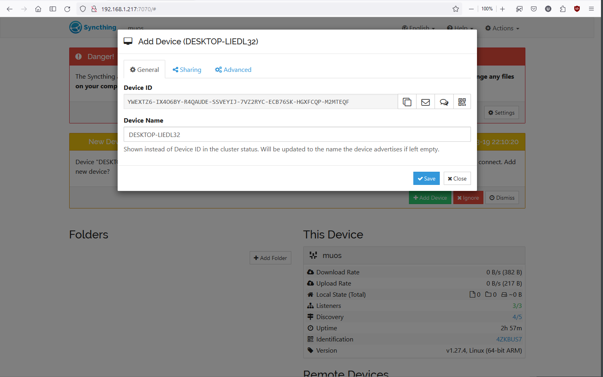
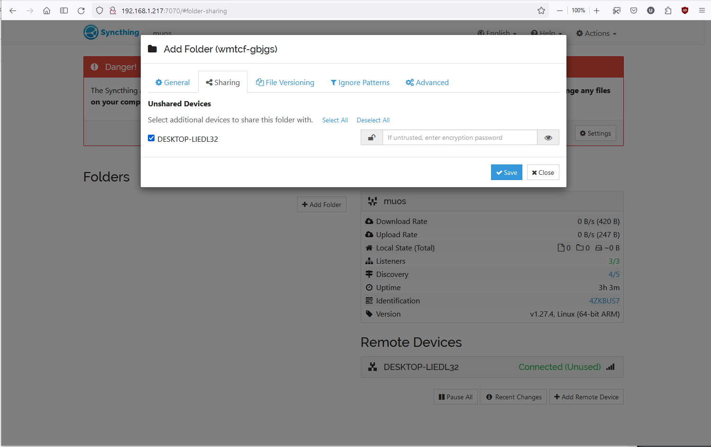
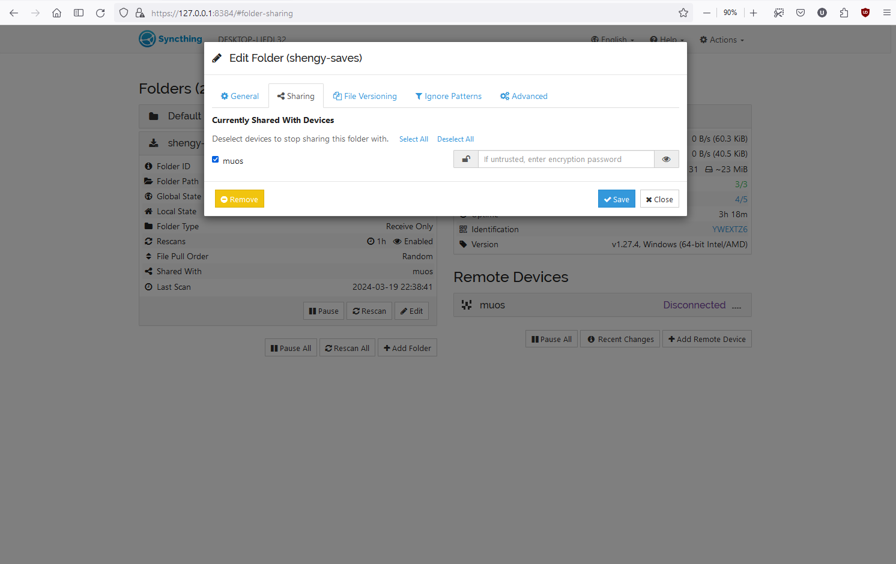

## How to Setup Syncthing with PC and MustardOS

## Terminology

| Name                                | Description                                                                                                                                                                                                                                                                                                                     |
|:------------------------------------|:--------------------------------------------------------------------------------------------------------------------------------------------------------------------------------------------------------------------------------------------------------------------------------------------------------------------------------|
 [Syncthing](https://syncthing.net/) | Syncthing is a continuous file synchronization program. It synchronizes files between two or more computers in real time, safely protected from prying eyes. Your data is your data alone and you deserve to choose where it is stored, whether it is shared with some third party, and how it’s transmitted over the internet. |

## General Idea

The guide will help you to setup Syncthing between a PC and MustardOS, if your host system is different the concept
would be the same however you might need to tweak a few things. In this guide we'll be syncing the MustardOS `save`
folder to
a PC as a backup method.

1. Install/Setup Syncthing on your PC
2. Enable/Setup Syncthing in MustardOS

## Steps

### 1 Install and setup Syncthing for PC

Download from the [here](https://github.com/Bill-Stewart/SyncthingWindowsSetup/)

After installation head to [127.0.0.1:8384](127.0.0.1:8384), you should see something like the following

### 1.1 Create a folder to sync that lives in PC

Click "Add Folder" and let's go through some important tabs

You would need to create a folder label, and set the folder path, note that the path here is what folder do you want to
sync on your PC.

Let's go to the File Versioning Tag

Here you can setup how back up files are being versioned, I prefer a Simple File Versioning, you can see the details by
clicking the Help link

Here I'm changing the Folder Type to be "Receive Only" because I would only be receiving save files from my MustardOS,
if you want to actually sync between your PC and MustardOS you can keep it as Send and Receive

## 2 Enable and Setup Syncthing in MustardOS

At this point we installed Syncthing in PC and we also setup a folder that would store our backed up save files on PC.
Now we need to setup Syncthing in MustardOS.

First make sure your MustardOS is connected to WiFi and note down your IP, your IP should look similar to 192.168.1.217,
from now on I would use 192.168.1.217 as the MustardOS IP.

In the MustardOS Main Menu -> Configuration -> Web Services -> Syncthing (toggle this to Enabled)

Once Syncthing is enabled in MustardOS, refresh [127.0.0.1:8384](127.0.0.1:8384), you should be seeing your PC
recognizing a new device on network, add it in by clicking "Add Device", pick a name of your device and click "Save"

At this point you added MustardOS in PC, but on PC's "Remove Devices" section you would see "muos" showing as "
Disconnected(Unused). Now you need to add PC in MustardOS

### 2.1 Add PC to MustardOS's Syncthing

Go to your MustardOS IP with port 7070, in my case it's `192.168.1.217:7070`, you should see the familiar Syncthing web
UI, here you should be able to see it recogonising your PC

Click "Add Device"

Pick a name of the device and click "Save"

Now you need to setup which folder in MustardOS to sync with your PC, under Folders section click "Add Folder", here
it's pretty much the same as how you added a folder in PC, the Folder Label could be anything but the Folder ID needs to
be same as the Folder ID you had in PC (wmtcf-gbjgs in this case), and you would need to set the folder path
to `/run/muos/storage/save/` if you only want to backup the saves. It would be nice to setup File Versioning and change
Advances to Send only to make sure the sync is going one way from MustardOS to PC in this setup

In "Sharing" tab also make sure to check your PC

### 2.2 Go back to share PC folder with MustardOS

Go back to [https://127.0.0.1:8384/](https://127.0.0.1:8384/) and click on the folder you created, click on "Edit", go
to Sharing tab and click `muos` (which is the device you are connected to)

## Caveats

Please note that that "Watch for Changes" option in Syncthing will only work on FAT32 partitions; for exFAT make sure
this option is disabled.

## The End

At this point your MustardOS would send your save files to your PC
